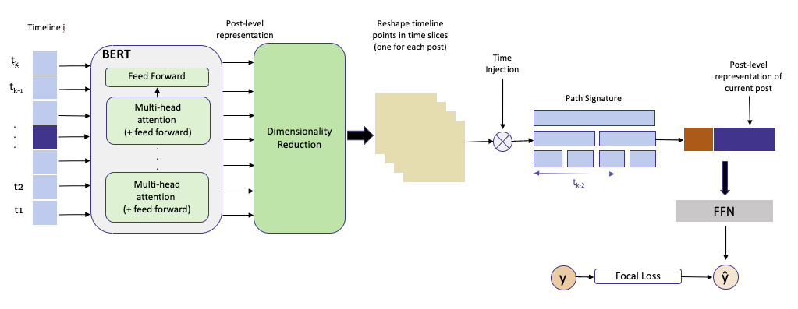

<div align="center">
    <br>
    <p align="center">
    <h2>Extract features from textual data using BERT and Path signature</h2>
    </p>
</div>


<p align="center">

</p>

## Installation

We recommend installation via Anaconda (refer to [Anaconda website and follow the instructions](https://docs.anaconda.com/anaconda/install/)).

* Create a new environment:

```bash
conda create -n py38esig python=3.8
```

* Activate the environment:

```bash
conda activate py38esig 
```

* Install dependencies:

```bash
pip install torch==1.8.1 signatory==1.2.6.1.8.1 sentence-transformers
pip install matplotlib
pip install datasets
pip install tqdm
pip install pandas
pip install umap-learn
pip install notebook
```

python -m ipykernel install --user --name py38esig --display-name "Python (py38esig)"
