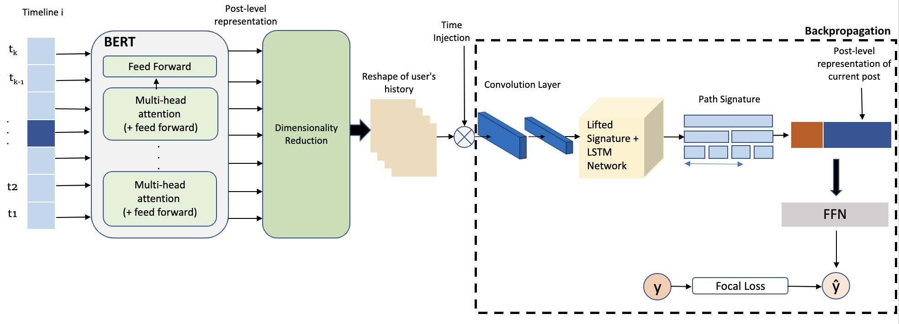

<div align="center">
    <br>
    <p align="center">
    <h2>Extract features from textual data using BERT and Path signature</h2>
    </p>
</div>

Original architecture:
<p align="center">

</p>

DeepSigNet architecture:
<p align="center">

</p>

## Installation

We recommend installation via Anaconda (refer to [Anaconda website and follow the instructions](https://docs.anaconda.com/anaconda/install/)).

* Linux and macOS

```bash
git clone git@github.com:ttseriotou/path_signatures_bert.git
cd path_signatures_bert
conda env create
conda activate nlpsig
pip install .
```

* Windows

We recommend first installing the [Windows Subsystem for Linux](https://docs.microsoft.com/en-us/windows/wsl/install) (WSL). You can then use the following to install Conda (following the Linux instructions [here](https://docs.conda.io/en/latest/miniconda.html#linux-installers)):

```bash
wget https://repo.anaconda.com/miniconda/Miniconda3-latest-Linux-x86_64.sh
bash Miniconda3-latest-Linux-x86_64.sh
```

You can then follow the installation instructions for Linux and macOS above.

* For using within Jupyter, you can create a kernel with:

```bash
python -m ipykernel install --user --name nlpsig --display-name "Python (nlpsig)"
```

### Use `nlpsig` without conda

To use `nlpsig` without conda:

```shell
git clone git@github.com:ttseriotou/path_signatures_bert.git
cd path_signatures_bert
pip install .
```

## Development

If you're developing `nlpsig` you may find it helpful to install it in editable mode:

```shell
pip install -e .
```

## Pre-commit

We also have a [pre-commit](https://pre-commit.com/) config to run the code quality tools. We use `flake8`, `isort`, and `black` automatically when making commits. To setup the commit hooks:

```shell
pre-commit install --install-hooks
```
